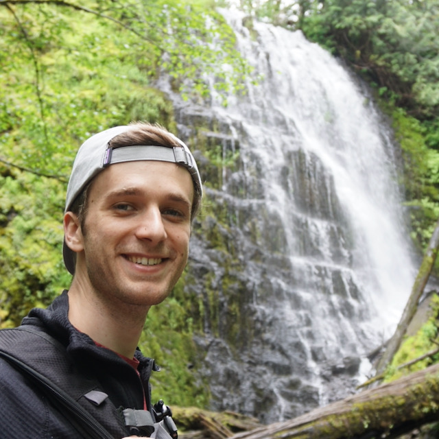

---
# Feel free to add content and custom Front Matter to this file.
# To modify the layout, see https://jekyllrb.com/docs/themes/#overriding-theme-defaults

layout: home
title: Aaron Lindsey
---

{:style="float:right;width:12em;margin-left:1em;margin-bottom:1em"}

Howdy 👋 I'm an engineer passionate about building secure and reliable software. I currently work at VMware as a committer on the [Apache Geode](https://geode.apache.org/) project and as a developer for the [Tanzu GemFire](https://tanzu.vmware.com/gemfire) product.

---
{:style="clear:both"}

